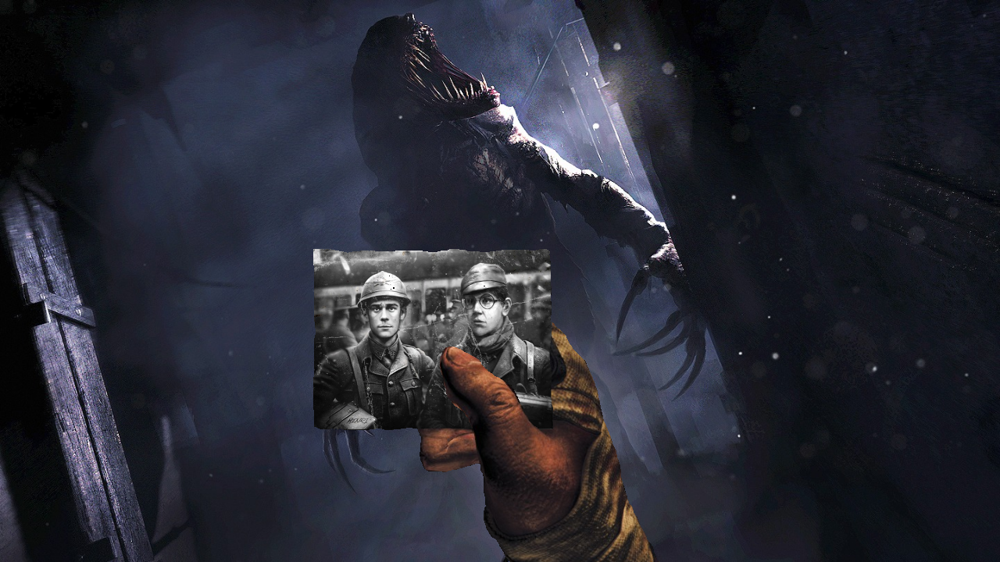

# 'No Jump to Notes' mod for Amnesia The Bunker

    

When playing with no-pause inventory, it will no longer jump to unread notes and photos, when opened.

It will still happen, if the inventory pause is enabled.

Steam Workshop link: [https://steamcommunity.com/sharedfiles/filedetails/?id=3430304643](https://steamcommunity.com/sharedfiles/filedetails/?id=3430304643)

## Compatibility:
Overrides `script/custom/modules/SketchbookUIHandler.hps`

## Release:
#### Name convention: \<ModVersion\>_\<GameVersion\>

### Latest
[m1.0_v1.31](https://github.com/pttoth/AmnesiaBunker_NoJumpToNotes/releases/tag/m1.0_v1.31)
